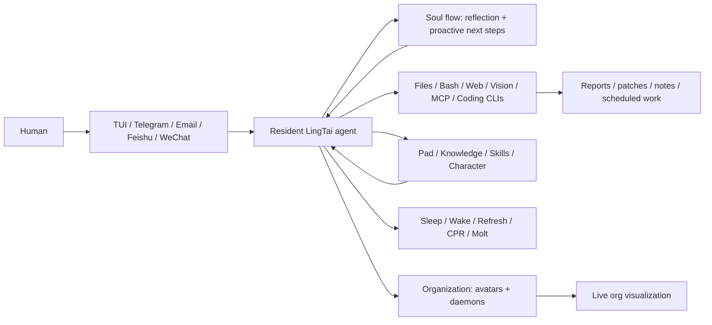

<div align="center">

# LingTai

**Build an AI organization inside your project — not just another agent.**

Local-first · resident agents · soul-flow proactiveness · mailboxes · lifecycle · multi-agent networks

[English](README.md) · [中文](README.zh.md) · [文言](README.wen.md) · [Website](https://lingtai.ai) · [Releases](https://lingtai.ai/releases/)

[](https://github.com/Lingtai-AI/homebrew-lingtai)
[](LICENSE)
[](https://github.com/Lingtai-AI/lingtai-kernel)
[](https://lingtai.ai)
[](https://discord.gg/cMchjXpg)

</div>

---

Most agent tools give you a better worker. **LingTai gives you the substrate for an AI organization**: long-lived local agents with home directories, inbox/outbox mailboxes, durable memory, lifecycle controls, self-reflection, and peers they can spawn or call when the work gets bigger than one mind.

Tools such as **OpenClaw** and **Hermes** are useful hands for executing agentic tasks. LingTai is the organizational layer around those hands: it can use coding agents and CLIs as workers, while preserving the roles, memory, communication, supervision, and recovery paths that let an agent network keep operating after a single chat or terminal session ends.

Send a task from the TUI, Telegram, Feishu/Lark, WeChat, WhatsApp, or email. The same organization wakes up through the addressed agent, reads project memory, uses local tools, writes artifacts, coordinates peers when needed, and replies on the channel where you started.

## A meta-organization, not another chat window

```text
You
  "Watch the repo overnight. If a PR breaks, inspect it, draft a fix,
   and send me a morning brief."

LingTai
  wakes from its mailbox
  → reads durable project memory
  → runs shell / web / file / coding-agent tools
  → reflects via soul flow when idle or stuck
  → writes notes, reports, patches, or schedules
  → asks a specialist avatar or daemon when parallel work helps
  → replies on Telegram / TUI / email with the artifacts
```

Close the terminal if you want. The organization still has a filesystem home under `.lingtai/`, mailboxes, logs you can inspect, and lifecycle controls to sleep, refresh, recover, or molt long sessions without losing the grain. Soul flow gives agents a built-in reflective loop: after idle time they can re-read the situation, notice missed angles, and surface proactive next steps instead of waiting forever for the next prompt.

## Start in three commands

```bash
brew install lingtai-ai/lingtai/lingtai-tui
mkdir my-project && cd my-project
lingtai-tui
```

On first run LingTai creates `.lingtai/`, provisions its own runtime, walks you through model/preset setup, and starts one resident assistant for the project.

### First-time install troubleshooting

Assume this is your first LingTai install. If the three commands above fail, start here — the common fixes are part of the install path, not a distant appendix.

**`brew` is not installed (macOS or Linux).** Install Homebrew first, then re-run the `brew install` command above:

```bash
/bin/bash -c "$(curl -fsSL https://raw.githubusercontent.com/Homebrew/install/HEAD/install.sh)"
```

The Homebrew installer ends by printing an `eval "$(... shellenv)"` line that adds `brew` to your `PATH`. Run that line (or open a new terminal) before continuing.

**WSL / Ubuntu / Debian.** Homebrew on Linux needs basic build tools before it can install packages. Install the prerequisites first, then Homebrew, then LingTai:

```bash
sudo apt update
sudo apt install -y build-essential curl git ca-certificates
```

**To upgrade later**, use Homebrew again and restart the TUI so the new binary takes over:

```bash
brew update
brew upgrade lingtai-ai/lingtai/lingtai-tui
lingtai-tui
```

**`brew install` fails while building.** A missing compiler toolchain is the usual cause. Install the prerequisites above, run `brew update`, and retry. If Homebrew still fails or is not available on your machine, use the [source build](#from-source) path below.

> The `lingtai` PyPI package exists, but it is the Python runtime the TUI manages on your behalf. Use Homebrew (or the source build below) to install and upgrade; reach for `pip` only when you are developing or diagnosing the kernel itself.

The first project you create will look like this:

```text
project/
└── .lingtai/
    ├── human/              # your mailbox identity
    └── <agent>/            # one resident project agent
        ├── inbox/ outbox/  # messages wake the agent
        ├── knowledge/      # durable facts and lessons
        ├── system/         # pad, summaries, standing rules
        └── logs/           # inspectable runtime trace
```

For source builds, mainland-China mirror setup, from-tarball install paths, and advanced runtime repair, see [Install in detail](#install-in-detail).

## What it is good at

| Use LingTai when you want... | What the agent actually does |
|---|---|
| **A daily project operator** | Scans changes, remembers decisions, summarizes blockers, and posts a brief before you sit down. |
| **GitHub triage with judgment** | Reads issues/PRs, categorizes risk, drafts replies or patches, and stops for approval before real side effects. |
| **Research that becomes an artifact** | Searches, fetches, compares, cites, and ships a standalone HTML memo instead of a loose chat transcript. |
| **Coding work that can run long** | Uses Claude Code, Codex, OpenCode, shell commands, and local files while LingTai keeps the plan and communication. |
| **Schedules that act** | "Every weekday at 9, check the deploy queue and ping me if anything is stuck" — not just a reminder. |
| **Memory across sessions** | Keeps paths, preferences, collaborator context, lessons, and reusable procedures for the next run. |

## Why it is different

| Agent tool / coding assistant | LingTai meta-organization builder |
|---|---|
| The conversation or run is the product. | The project organization is the product; conversations are only input channels. |
| Tools like OpenClaw or Hermes act as capable workers for a task. | LingTai supplies the persistent org chart around the workers: memory, mail, roles, lifecycle, supervision, and recovery. |
| Closing the window ends the relationship. | Agents have local homes, mailboxes, logs, memory, and lifecycle. |
| Proactiveness depends on the user prompting again. | Soul flow lets an idle agent reflect, surface missed angles, and propose next moves. |
| Scaling means juggling more chats or runs. | Spawn persistent avatars for specialists or short-lived daemons for parallel work; watch the topology in the portal. |
| A bad turn means restart and hope. | Sleep, wake, refresh, CPR, clear, doctor, and molt are built into the runtime. |

## Architecture at a glance



## Builds an organization as the work grows

Start with one resident agent. When the work grows, the organization grows with it:

- **Molt instead of forgetting.** Long sessions shed noisy transcript while carrying forward summaries and durable memory.
- **Reflect instead of waiting.** Soul flow gives the agent an inner review loop for proactive insight when the project goes quiet or a path looks wrong.
- **Spawn an avatar.** Give a persistent specialist its own memory, mailbox, and responsibility.
- **Emanate a daemon.** Split a noisy batch into short-lived workers and keep only the conclusions.
- **Use coding agents as hands.** Claude Code, Codex, OpenCode, OpenClaw, Hermes, and similar tools can execute precise work while LingTai owns the plan, memory, coordination, and communication.
- **Watch it live.** The portal shows who is alive, what they are doing, and how the organization has changed.

<div align="center">


</div>

## External channels

LingTai bridges the same long-lived assistant to the messaging surfaces you already use. The currently curated MCP addons:

| Addon | Use it for |
|---|---|
| `telegram` | Talk to your assistant from Telegram (DMs, optional allowlist, voice/file passthrough). |
| `feishu` | Feishu/Lark — uses a WebSocket long connection, no public IP required. |
| `wechat` | WeChat through an iLink/gewechat-style bridge. |
| `whatsapp` | WhatsApp through the curated LingTai WhatsApp bridge. |
| `imap` | Real email through IMAP/SMTP — multi-account, with safety defaults for unknown senders. |

Channels are doors into the *same* assistant, not separate bots. Memory, tools, and history are shared across them. Configure from the TUI's `/mcp` control panel, or declare them in `init.json`.

Credentials live in local `.secrets/` files (never in Git). Unknown external senders do not auto-receive replies. External side effects (sending messages, filing issues, deleting resources) are treated as real actions by default.

## The interface

### TUI

`lingtai-tui` is the main human surface. It gives you setup, model/preset configuration, chat and mail, agent status (token + stamina + heartbeat), avatar and daemon visibility, markdown rendering, a slash-command palette, and upgrade/doctor flows.

Use `/help` inside the TUI for the complete slash-command reference. The canonical docs live in the bundled [`lingtai-tui-help` skill](tui/internal/preset/skills/lingtai-tui-help/assets/slash-commands.en.md); this README intentionally points there instead of duplicating the command catalog.

Shell entrypoints when useful:

```bash
lingtai-tui                          # open the TUI in the current project
lingtai-tui list [--detailed] [--admin] <project>  # contact-book view of running agents; marks main agents
lingtai-tui spawn <dir> --preset <name> [--agent-name <name>]
lingtai-tui bootstrap                # re-extract bundled skills/utilities
lingtai-tui doctor                   # repair/update TUI runtime
```

### Portal

`lingtai-portal` is the visualization server. It reads project state to show the agent network, mail edges, and history. It becomes useful when you have more than one assistant per project, or when you want to see how the work evolved.

### Tips

- Use a dark terminal theme — LingTai's palette is tuned for it.
- `Ctrl+E` in the TUI opens an external editor for long messages.
- Hold `Option` (macOS/iTerm2) or `Shift` (most Linux/Windows terminals) to select text without the TUI capturing it.
- If anything feels broken after an upgrade, run `/doctor` (or `lingtai-tui doctor` from a shell).

## Filesystem you can read

LingTai keeps state on disk, on purpose. You can debug it with `ls`, `cat`, `tail`, `jq`, `grep`, your editor, or another coding agent. The shape after first launch:

```text
project/
└── .lingtai/
    ├── human/                  # your mailbox identity
    ├── <agent-name>/            # one running assistant
    │   ├── init.json            # model, tools, preset, MCP wiring
    │   ├── system/              # prompt layers, pad, rules, summaries
    │   ├── knowledge/           # durable private memory
    │   ├── inbox/ outbox/       # internal mail
    │   ├── logs/                # event log + human-readable log
    │   ├── delegates/           # spawned-avatar ledger
    │   ├── daemons/             # daemon run records
    │   └── .agent.json          # heartbeat, status, identity card
    └── .portal/                 # topology/history for visualization
```

Useful inspection commands:

```bash
lingtai-tui list --detailed /path/to/project               # running agents, main-agent marker, identity/state/path
tail -f /path/to/project/.lingtai/<agent>/logs/agent.log    # human-readable log
jq -r '.event' /path/to/project/.lingtai/<agent>/logs/events.jsonl | tail   # structured events
```

## Use coding agents as hands

LingTai assistants live in the filesystem, so coding agents can work with them in two ways. As **daemon backends**, Claude Code, Codex, and OpenCode can be launched for focused implementation or review jobs while LingTai keeps the long-running plan and memory. As **peer tools**, any coding agent that can read and write files can collaborate through the shared `.lingtai/human/` mailbox.

- **Claude Code** — `claude plugin add Lingtai-AI/claude-code-plugin`
- **OpenAI Codex CLI** — `git clone https://github.com/Lingtai-AI/codex-plugin.git && cd codex-plugin && ./install.sh`
- **Other coding agents** (OpenCode, OpenClaw, Hermes, …) — vendor the [`lingtai-skill`](https://github.com/Lingtai-AI/lingtai-skill) protocol skill under your tool's skills directory.

The split: a coding agent is precise and verifiable — every tool call visible, every edit reviewable. A LingTai assistant is asynchronous and patient — it remembers the goal, talks to the human, coordinates parallel contexts, and decides when to hand work to a specialist. Use the coding agent as hands. Use LingTai as the long-running collaborator that plans, drafts, monitors, and remembers.

## ResearchClawBench: evaluate agents on real research work

If you are exploring AI agents for science, take a look at [ResearchClawBench](https://github.com/InternScience/ResearchClawBench) ([official site](https://internscience.github.io/ResearchClawBench-Home/)). It is an open benchmark for automated research agents, spanning re-discovery and new-discovery tasks across scientific domains.

ResearchClawBench is a useful companion for the LingTai philosophy: LingTai provides the local, long-lived organizational substrate — memory, mailboxes, avatars, daemons, and human-facing coordination — while benchmarks like ResearchClawBench make the research-agent work measurable. Use it to compare how Claude Code, Codex, OpenClaw-style agents, and LingTai-coordinated workflows behave on end-to-end scientific tasks.

## Install in detail

### Homebrew (recommended)

```bash
brew install lingtai-ai/lingtai/lingtai-tui
lingtai-tui

# upgrade later
brew update
brew upgrade lingtai-ai/lingtai/lingtai-tui
```

After upgrading, restart the TUI so the new binary takes over. The TUI manages the Python runtime under `~/.lingtai-tui/runtime/venv/` — installing `lingtai` into your system Python does not affect a running project.

First-time install problems (missing `brew`, WSL/Ubuntu/Debian prerequisites, source-build failures) are covered up top in [First-time install troubleshooting](#first-time-install-troubleshooting).

### From source

You need Go, `make`, and (for the portal) Node.js/npm.

Use this when hacking on the TUI/portal itself or when Homebrew is unavailable:

```bash
git clone https://github.com/Lingtai-AI/lingtai.git
cd lingtai
./install.sh
lingtai-tui
```

`install.sh` builds `lingtai-tui` and (when `npm` is available) `lingtai-portal`, then installs binaries into the Homebrew prefix if `brew` exists, otherwise `/usr/local/bin`.

### Kernel dev mode (advanced)

Only if you are editing the kernel checkout and want your edits to take effect immediately in the TUI runtime:

```bash
~/.lingtai-tui/runtime/venv/bin/pip3 install -e /path/to/lingtai-kernel
```

### Runtime repair

```bash
lingtai-tui doctor
```

`doctor` checks the TUI/kernel/runtime relationship, refreshes shipped utility skills, and reports concrete repair steps. Use it after a failed startup or a stale-looking upgrade.

## Architecture

LingTai is split across two repositories.

| Repository | Language | Owns |
|---|---|---|
| [`Lingtai-AI/lingtai`](https://github.com/Lingtai-AI/lingtai) (this one) | Go + TypeScript | TUI, portal, Homebrew/source install, shipped utility skills. |
| [`Lingtai-AI/lingtai-kernel`](https://github.com/Lingtai-AI/lingtai-kernel) | Python (+ Rust sidecar pieces) | Agent runtime, LLM turn loop, intrinsic tools, session/context/molt management, MCP host. Published as the `lingtai` PyPI package. |

The Go TUI does not run the agent mind. It launches and supervises Python kernel agents as subprocesses; everything between UI and agents flows through the project filesystem (`.lingtai/` mailboxes, heartbeats, logs, prompt files, portal records). That is why the state is so easy to inspect — and why other tools can cooperate with it without any SDK.

This repo carries two Go binaries:

| Tree | Binary | Description |
|---|---|---|
| `tui/` | `lingtai-tui` | Bubble Tea terminal app, setup wizard, process monitor, slash-command shell, preset editor, upgrade/doctor flows. |
| `portal/` | `lingtai-portal` | Go HTTP server with an embedded React frontend for topology/replay visualization. |

## Docs by goal

- **New here?** Run `lingtai-tui`, pick the **Tutorial** recipe, follow the prompts. A Chinese beginner-friendly manual is also available at [`docs/beginner-work-manual.zh.md`](docs/beginner-work-manual.zh.md), with an animated version at [`docs/beginner-work-manual-stick-figure.zh.html`](docs/beginner-work-manual-stick-figure.zh.html).
- **Set up a channel** — `/mcp` inside the TUI, then the addon's own onboarding resource.
- **Write a skill** — see `tui/internal/preset/skills/lingtai-dev-guide/` after first launch.
- **Source layout** — start at [`ANATOMY.md`](ANATOMY.md), then descend into `tui/ANATOMY.md` or `portal/ANATOMY.md`.
- **Navigate by knowledge graph** — generate and query a repo map with Graphify; see [`docs/graphify.md`](docs/graphify.md).
- **Release process** — [`RELEASING.md`](RELEASING.md).
- **Contributing** — anatomy-first, worktree-first, with validation in the PR body. See [Contributing](#contributing).

## Repository map

```text
.
├── README.md / README.zh.md / README.wen.md
├── ANATOMY.md                 # source-grounded repo map for agents and humans
├── CLAUDE.md                  # coding-agent guidance
├── RELEASING.md               # release checklist
├── install.sh                 # source installer
├── tui/                       # lingtai-tui Go module
│   ├── main.go
│   ├── internal/              # TUI implementation
│   ├── i18n/                  # en/zh/wen UI strings
│   └── packages/              # npm wrapper metadata
├── portal/                    # lingtai-portal Go module
│   ├── main.go
│   ├── web/                   # React/Vite frontend
│   └── i18n/
├── docs/                      # design notes, blog, status, known limitations
├── examples/                  # example init/addon/policy JSONC files
├── scripts/                   # helper scripts
└── discussions/               # design patches and investigation notes
```

## Troubleshooting

**`lingtai-tui` is not found.** Make sure Homebrew's bin directory is on `PATH` (`brew --prefix`/bin). If you used `install.sh`, check `/usr/local/bin/lingtai-tui` or the Homebrew prefix.

**The TUI starts but the assistant does not respond.** Run `lingtai-tui doctor` and `lingtai-tui list /path/to/project`, then `tail -100 /path/to/project/.lingtai/<agent>/logs/agent.log`.

**A skill or command is missing.** `lingtai-tui bootstrap` (or `/doctor` inside the TUI) re-extracts bundled utilities.

**You upgraded but behavior did not change.** Two layers: the Go TUI binary (Homebrew/source) and the Python runtime (TUI-managed venv). Restart the TUI after upgrading; run `doctor` if the runtime looks stale. Installing the `lingtai` PyPI package into your system Python does not affect projects.

**You are developing the kernel and your edits are ignored.** See [Kernel dev mode](#kernel-dev-mode-advanced).

## Development

### Prerequisites

Before running the local development commands below, make sure these tools are available:

- **Git** for cloning the repository and using the worktree-based contribution workflow.
- **Go 1.26.1 or newer compatible Go release**. Both Go modules currently declare `go 1.26.1` (`tui/go.mod` and `portal/go.mod`).
- **Node.js and npm** for the portal web frontend under `portal/web` (`npm ci` and `npm run build`). Use a recent LTS Node.js release unless the frontend tooling is pinned more tightly in the future.
- **make** for the Makefile-based workflows in `tui/` and `portal/` (for example, `cd tui && make build` or `cd portal && make build`). The validation commands below also show the direct `go`/`npm` commands.
- **A POSIX-compatible shell** for the shell snippets and installer scripts. On Windows, use WSL, MSYS2, or an equivalent environment.

For non-trivial changes, work in a Git worktree off `origin/main`:

```bash
cd /path/to/lingtai
git fetch origin main
git worktree add -b docs/my-change .worktrees/my-change origin/main
cd .worktrees/my-change
```

Validation:

```bash
# TUI changes
cd tui && go test ./... && go vet ./... && go build -o bin/lingtai-tui .

# Portal changes
cd portal/web && npm ci && npm run build && cd .. && go test ./... && go build -o bin/lingtai-portal .

# Docs-only
git diff --check && git status --short
```

If a doc change references generated UI commands or shipped skills, regenerate via `lingtai-tui bootstrap` and inspect `~/.lingtai-tui/commands.json`.

## Contributing

LingTai contributions are source-grounded and workflow-aware.

1. Read the relevant anatomy first: root `ANATOMY.md`, then `tui/ANATOMY.md` or `portal/ANATOMY.md`.
2. Work in a branch/worktree.
3. Keep changes scoped.
4. Run the relevant validation commands.
5. Update anatomy/docs when structural behavior changes.
6. Open a PR that says what changed, why, and how you validated it.

Common areas that need help: TUI usability and accessibility, portal visualization and replay, MCP/addon onboarding, cross-platform install polish, docs and tutorials, runtime diagnostics, and high-quality reusable skills.

## Design philosophy

LingTai borrows its name from the heart-mind — the square inch where transformation begins. The product follows three practical beliefs:

1. **Assistants need bodies.** A durable filesystem home gives continuity, inspectability, and a place to accumulate tools and memory.
2. **Networks should grow through service.** When a task needs a new capability, write a skill, record knowledge, or spawn a specialist, and the next task gets easier.
3. **Memory must be layered.** Conversation is temporary. Pad, character, knowledge, skills, and mail carry what matters forward.

The goal is not agent theater. The goal is useful long-running AI collaborators that can be inspected, restarted, taught, and improved.

## Community

- Website and release notes: <https://lingtai.ai>
- Main repo: <https://github.com/Lingtai-AI/lingtai>
- Kernel repo: <https://github.com/Lingtai-AI/lingtai-kernel>
- Homebrew tap: <https://github.com/Lingtai-AI/homebrew-lingtai>
- Discord: <https://discord.gg/cMchjXpg>
- GitHub issues: <https://github.com/Lingtai-AI/lingtai/issues>
- GitHub discussions: <https://github.com/Lingtai-AI/lingtai/discussions>

For Chinese-language discussion and early testing, scan the WeChat QR below. Add the author on WeChat with the note `lingtai`; if the QR has expired, please open an issue and we will refresh it.


## Star history

[](https://www.star-history.com/#Lingtai-AI/lingtai&Date)

## License

Apache-2.0 — see [LICENSE](LICENSE).
