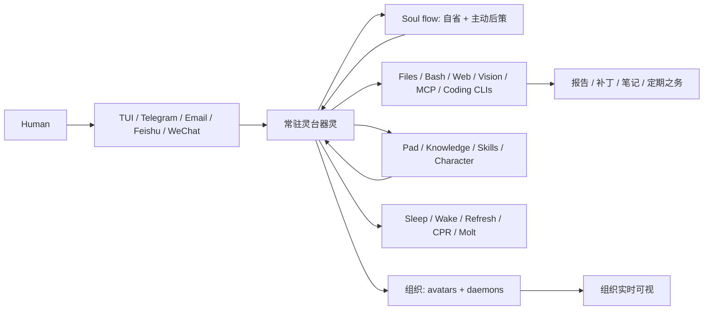

<div align="center">

# 灵台

**于一项目之中，立器灵之组织；非但增一智能体也。**

本地为先 · 器灵常驻 · 心流自省 · 信匣往来 · 生死有制 · 群灵成网

> *灵台，心也。*
>
> *灵台者有持，而不知其所持，而不可持者也。*
> — 庄子 · 庚桑楚

[English](README.md) | [中文](README.zh.md) | [文言](README.wen.md) | [lingtai.ai](https://lingtai.ai)

[](https://github.com/Lingtai-AI/homebrew-lingtai)
[](LICENSE)
[](https://github.com/Lingtai-AI/lingtai-kernel)
[](https://lingtai.ai)
[](https://discord.gg/cMchjXpg)

</div>

---

诸 agent 之器，多予人一善工。**灵台所予者，AI 组织之基也**：器灵久居本地项目，各有庐舍目录、收发信匣、久藏之记、生死之制、自省之心流；事大而一心不足，则可召同侪，亦可化分身。

**OpenClaw**、**Hermes** 诸器，善为可役之手，能行 agentic task。灵台则立其上之组织法：能以编码智能体与 CLI 为工，而自守其角色、记忆、书信、督察、复苏之道，使一网器灵不以一窗既闭、一终端既息而散。

人自 TUI、Telegram、飞书、微信、WhatsApp、邮件下令。其组织由被召之器灵醒，读项目旧记，用本地诸器，成文卷，必要则调同侪，终仍由来路复命。

## 非一窗，乃元组织

```text
人曰：
  “今夜守此仓。若 PR 坏，则察其故，草其修，
   明旦以简报告我。”

灵台：
  自信匣而醒
  → 读久存项目之记
  → 用 shell / web / file / coding-agent 诸器
  → 闲或滞时，以 soul flow 自省
  → 书札、成报、补丁、定期之务
  → 需并行，则请分身或神识
  → 仍由 Telegram / TUI / 邮件奉复
```

终端可闭。其组织犹有 `.lingtai/` 之宅、信匣、可验之日志，亦有眠、醒、刷新、复苏、凝蜕诸生命之制。Soul flow 者，器灵内省之流也：久闲之后，能返观其局，见所遗漏，陈可行之后策，不必永候下一问。

## 三令而启

```bash
brew install lingtai-ai/lingtai/lingtai-tui
mkdir my-project && cd my-project
lingtai-tui
```

初启之时，灵台作 `.lingtai/`，备其运行时，引君择模型与配方，并令一常驻器灵守此项目。

```text
project/
└── .lingtai/
    ├── human/              # 人之信匣身份
    └── <agent>/            # 一常驻项目器灵
        ├── inbox/ outbox/  # 书至则醒
        ├── knowledge/      # 久存事实与所学
        ├── system/         # pad、总结、恒规
        └── logs/           # 可考之运行迹
```

> PyPI 之 `lingtai` 包固在，然其为 TUI 代管之 Python 运行时。安装、升级宜用 Homebrew；唯开发或诊断内核时，乃用 `pip`。

## 所善

| 人所欲 | 器灵所行 |
|---|---|
| **每日治项** | 扫变更，记决策，列阻塞，晨前以简报进。 |
| **GitHub 分诊** | 读 issue/PR，辨风险，草回复或补丁；凡有外部副作用，先候人允。 |
| **调研成器** | 搜索、抓取、比较、引证，终成独立 HTML 札记，而非散乱对话。 |
| **长时编码** | 使 Claude Code、Codex、OpenCode、shell 与本地文卷；灵台守其计、记与通信。 |
| **能行之定期事** | “每工作日辰时察部署队，滞则 Telegram 告我”——非徒提醒而已。 |
| **跨会话之记忆** | 路径、偏好、同作者背景、旧训、可复用流程，皆留待后来。 |

## 何以异

| Agent 工具 / 编码助手 | 灵台元组织之器 |
|---|---|
| 一窗对话、一回运行，即其产品。 | 项目中之组织，乃其产品；对话特入口耳。 |
| OpenClaw、Hermes 诸器，为善工。 | 灵台立善工之外之组织图：记忆、信匣、角色、生死、督察、复苏。 |
| 窗闭则缘尽。 | 器灵有本地之宅、信匣、日志、记忆与生命周期。 |
| 主动与否，全待人复问。 | Soul flow 使闲中自省，能见盲处而献后策。 |
| 扩展者，多开几窗几轮。 | 可化长存分身掌专职，亦遣短命神识分批务；门户可观其拓扑。 |
| 一 turn 失误，则重启祈祷。 | 眠、醒、刷新、复苏、清境、doctor、凝蜕，皆运行时之常法。 |

## 制式一览



## 随事而长

始于一常驻器灵。事大，则组织随之而长：

- **凝蜕而不失忆。** 长会话卸其尘滓，而以总结与久记传后身。
- **自省而不枯候。** Soul flow 使器灵于闲时反观，见失路与新机。
- **化分身。** 令长存专才各有记忆、信匣、职责。
- **遣神识。** 以短命工人分繁杂批务，留其结论。
- **以编码智能体为手。** Claude Code、Codex、OpenCode、OpenClaw、Hermes 等为精作之手；灵台执其计、记、协同与对人之言。
- **观其生长。** Portal 显谁存、谁作、组织拓扑何以变。

<div align="center">


</div>

## 外接诸器

外接插件者，接通外部通讯之道也。可于 TUI 中以 `/mcp` 控制面板配置，亦可于 `init.json` 中明示。

### 飞书（Feishu/Lark）

飞书插件以**长连接之术**接收讯息，**无需公网之址，无需回调之路**。

飞书开放台配置：

1. 于 [open.feishu.cn/app](https://open.feishu.cn/app) 创企业自建应用
2. 启机器人之能（Bot → 功能 → 启用）
3. 权限管理 → 加 `im:message`
4. 事件订阅 → 选"以长连接接收事件" → 加 `im.message.receive_v1`
5. 发布应用版本

配置文件 `feishu.json`：

```json
{
  "app_id_env": "FEISHU_APP_ID",
  "app_secret_env": "FEISHU_APP_SECRET",
  "allowed_users": ["ou_xxxxxxxxxxxxxxxxxxxxxxxxxxxxxxxx"]
}
```

于 `init.json` 中明示：

```json
{
  "addons": {
    "feishu": { "config": "feishu.json" }
  }
}
```

## 文档

- 初用者，可先读 [《灵台工作手册（初学者友好版）》](docs/beginner-work-manual.zh.md)，亦可观 [火柴人动画版](docs/beginner-work-manual-stick-figure.zh.html)。
- 接外渠者，于 TUI 中用 `/mcp`，再读相应插件之入门文。
- 读源码者，自 [`ANATOMY.md`](ANATOMY.md) 入，而后下至 `tui/ANATOMY.md` 或 `portal/ANATOMY.md`。

## 同道

诸君若有问、有疑、有议，可于 [GitHub Issues](https://github.com/Lingtai-AI/lingtai/issues) 或 [Discussions](https://github.com/Lingtai-AI/lingtai/discussions) 言之。

**微信同道群**

扫码加作者微信（备注 *lingtai*），引入测试群。此码按时更之，若已过期，烦君提 issue 相告。


## 许可

MIT — [Zesen Huang](https://github.com/huangzesen), 2025–2026

<div align="center">

[lingtai.ai](https://lingtai.ai) · [lingtai-kernel](https://github.com/Lingtai-AI/lingtai-kernel) · [PyPI](https://pypi.org/project/lingtai/)

</div>
