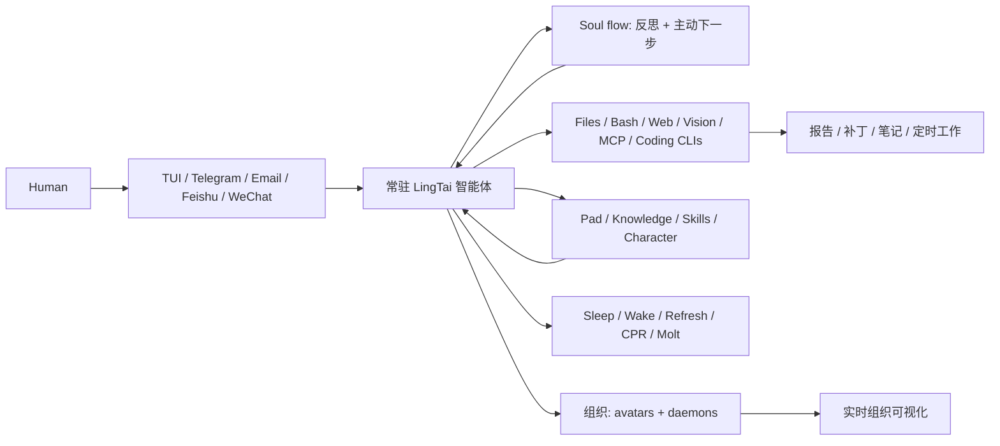

<div align="center">

# 灵台 LingTai

**在你的项目里建起一个 AI 组织——不只是再多一个 Agent。**

本地优先 · 常驻智能体 · soul flow 主动反思 · 信箱 · 生命周期 · 多智能体组织

[English](README.md) · [中文](README.zh.md) · [文言](README.wen.md) · [lingtai.ai](https://lingtai.ai) · [发布日志](https://lingtai.ai/releases/)

[](https://github.com/Lingtai-AI/homebrew-lingtai)
[](LICENSE)
[](https://github.com/Lingtai-AI/lingtai-kernel)
[](https://lingtai.ai)
[](https://discord.gg/cMchjXpg)

</div>

---

多数 agent 工具给你的是一个更强的工人。**灵台给你的是一个 AI 组织的底座**：长期住在本地项目里的智能体，有自己的主目录、收发信箱、持久记忆、生命周期控制、自我反思回路，也能在任务大到一个脑袋不够时召唤同伴或化出分身。

**OpenClaw**、**Hermes** 这类工具是很有用的“手”——擅长执行某个 agentic task。灵台是围绕这些手的组织层：它可以把编码 agent 和 CLI 当作工人来用，同时保留角色、记忆、通信、监督、恢复这些让一个智能体网络在单次聊天或终端会话结束后仍能继续运转的组织能力。

你可以从 TUI、Telegram、飞书/Lark、微信、WhatsApp 或邮件发来任务。同一个组织会通过被点名的智能体醒来，读取项目记忆，调用本地工具，写出产物，必要时协调同伴，然后回到你发起任务的那个渠道向你汇报。

## 这是元组织，不是另一个聊天窗口

```text
你
  “今晚盯一下仓库。PR 如果坏了，就定位原因，草拟修复，
   明早给我一份简报。”

灵台
  从信箱中醒来
  → 读取持久项目记忆
  → 调用 shell / web / file / coding-agent 工具
  → 空闲或卡住时通过 soul flow 自我反思
  → 写下笔记、报告、补丁或定时任务
  → 需要并行时请专家分身或神识帮忙
  → 在 Telegram / TUI / 邮件里带着产物回复你
```

你可以关掉终端。这个组织仍然有 `.lingtai/` 下的文件系统家园、信箱、可检查的日志，以及休眠、刷新、复苏、凝蜕等生命周期控制。Soul flow 给智能体内置了一条反思回路：空闲一段时间后，它可以重新审视局面、发现漏掉的角度，并主动提出下一步，而不是永远等下一句提示词。

## 三条命令开始

```bash
brew install lingtai-ai/lingtai/lingtai-tui
mkdir my-project && cd my-project
lingtai-tui
```

首次启动时，灵台会创建 `.lingtai/`，准备自己的运行时，引导你配置模型/配方，并为这个项目启动一个常驻智能体。

```text
project/
└── .lingtai/
    ├── human/              # 你的信箱身份
    └── <agent>/            # 一个常驻项目智能体
        ├── inbox/ outbox/  # 消息会唤醒智能体
        ├── knowledge/      # 持久事实与经验
        ├── system/         # pad、总结、长期规则
        └── logs/           # 可审计的运行轨迹
```

> PyPI 上的 `lingtai` 包确实存在，但那是 TUI 代你管理的 Python 运行时。安装/升级请用 Homebrew（或下方源代码方式）；只有在你开发或诊断内核本身时才需要 `pip`。

源代码编译、大陆镜像、tarball 安装等路径见 [安装详解](#安装详解)。

## 适合用来做什么

| 当你想要…… | 灵台实际会做什么 |
|---|---|
| **每日项目运营** | 扫描变化、记住决策、整理阻塞项，在你坐下前把简报发来。 |
| **带判断的 GitHub 分诊** | 读取 issue/PR，分类风险，草拟回复或补丁；真正有副作用前停下来让你批准。 |
| **能沉淀为产物的调研** | 搜索、抓取、比较、引用，最后交付独立 HTML 备忘录，而不是一段松散聊天记录。 |
| **可以跑很久的编码工作** | 调用 Claude Code、Codex、OpenCode、shell 和本地文件；灵台负责计划、记忆和对人同步。 |
| **会行动的定时任务** | “每个工作日 9 点检查部署队列，卡住了在 Telegram 叫我”——不只是提醒。 |
| **跨会话记忆** | 保留路径、偏好、合作者背景、历史教训和可复用流程，留给下一轮继续用。 |

## 为什么不同

| Agent 工具 / 编码助手 | 灵台元组织构建器 |
|---|---|
| 对话或一次运行本身就是产品。 | 项目里的组织才是产品；对话只是入口。 |
| OpenClaw、Hermes 这类工具是能干活的工人。 | 灵台提供围绕工人的长期组织图：记忆、信箱、角色、生命周期、监督与恢复。 |
| 关掉窗口，关系就结束。 | 智能体有本地主目录、信箱、日志、记忆和生命周期。 |
| 主动性取决于用户再次提示。 | Soul flow 让空闲智能体能自我反思、发现盲点、提出下一步。 |
| 扩展意味着同时管理更多聊天或运行。 | 化出长期分身负责专门领域，或用短期神识拆并行批活；在 portal 里看拓扑变化。 |
| 一次坏 turn 只能重开并祈祷。 | 休眠、唤醒、刷新、复苏、清上下文、doctor、凝蜕都是运行时的一部分。 |

## 架构一眼看懂



## 跟着工作一起长成组织

先从一个常驻智能体开始。工作变大时，组织也一起长大：

- **凝蜕，而不是失忆。** 长会话会卸下噪音 transcript，把总结和持久记忆带到下一轮。
- **反思，而不是干等。** Soul flow 给智能体一个内在复盘回路，项目安静下来或路径不对时能主动提出洞见。
- **化出分身。** 给长期专家一个自己的记忆、信箱和责任边界。
- **遣出神识。** 把嘈杂批量任务拆给短期工人，只留下结论。
- **把编码 agent 当手。** Claude Code、Codex、OpenCode、OpenClaw、Hermes 等工具负责精确执行；灵台负责计划、记忆、协调和对人沟通。
- **现场看组织生长。** Portal 显示谁在线、在做什么，以及组织拓扑如何变化。

<div align="center">


</div>

## 外接渠道

灵台把同一个长存助理接到你已经在用的消息平台上。目前精选的 MCP 插件：

| 插件 | 用途 |
|---|---|
| `telegram` | 在 Telegram 跟你的助理对话（DM、可选白名单、附件/语音透传）。 |
| `feishu` | 飞书 / Lark——使用 WebSocket 长连接，**无需公网 IP，无需 Webhook**。 |
| `wechat` | 通过 iLink / gewechat 风格的桥接接入微信。 |
| `whatsapp` | 通过灵台精选 WhatsApp 桥接接入 WhatsApp。 |
| `imap` | 真正的 IMAP/SMTP 邮件——多账号、对陌生发件人有安全默认。 |

渠道是同一个助理的多个入口，不是各自独立的机器人。**记忆、工具、历史在所有渠道之间共享**。配置入口在 TUI 的 `/mcp` 控制面板，或者直接写到 `init.json` 里。

凭证存在本地 `.secrets/` 目录（绝不会进 Git）。对陌生外部发件人默认不会自动回复。外部副作用（发消息、提 issue、删除资源）默认按真实操作对待。

## 界面

### TUI

`lingtai-tui` 是主交互界面。提供：项目初始化、模型/预设配置、对话与信箱、助理状态（token + 体力 + 心跳）、分身/神識可见性、Markdown 渲染、命令面板、升级与 doctor 流程。

在 TUI 里输入 `/help` 可查看完整斜杠命令参考。权威文档维护在内置 [`lingtai-tui-help` 技能](tui/internal/preset/skills/lingtai-tui-help/assets/slash-commands.zh.md)；顶层 README 只链接到那里，避免重复维护命令目录。

常用 Shell 入口：

```bash
lingtai-tui                          # 在当前项目打开 TUI
lingtai-tui list [--detailed] [--admin] <project>  # 以通讯簿视图列出在线助理，并标出主 agent
lingtai-tui spawn <dir> --preset <name> [--agent-name <name>]
lingtai-tui bootstrap                # 重新展开自带技能/工具
lingtai-tui doctor                   # 修复/升级 TUI 运行时
```

### Portal

`lingtai-portal` 是可视化服务器。它读取项目状态，呈现智能体网络、信件边、历史拓扑。当一个项目里不止一个助理、或者你想看清工作如何演变时，这玩意儿很有用。

### 小贴士

- 终端用深色主题——灵台的调色板是按深色调过的。
- TUI 里 `Ctrl+E` 打开外部编辑器写长消息。
- 选择文本时按住 `Option`（macOS / iTerm2）或 `Shift`（多数 Linux/Windows 终端），避免被 TUI 抓取。
- 升级后哪里不对劲？跑 `/doctor`（或在 shell 里 `lingtai-tui doctor`）。

## 文件系统可以直接看

灵台**故意**把状态放在磁盘上。`ls`、`cat`、`tail`、`jq`、`grep`、编辑器、甚至另一个编程智能体都能直接看。首次启动后的目录形状：

```text
project/
└── .lingtai/
    ├── human/                  # 你的信箱身份
    ├── <agent-name>/            # 一个在线的助理
    │   ├── init.json            # 模型、工具、配方、MCP 配置
    │   ├── system/              # 提示分层、Pad、规则、总结
    │   ├── knowledge/           # 持久私有记忆
    │   ├── inbox/ outbox/       # 内部信件
    │   ├── logs/                # 事件日志 + 人读日志
    │   ├── delegates/           # 化身台账
    │   ├── daemons/             # 神識运行记录
    │   └── .agent.json          # 心跳、状态、身份卡
    └── .portal/                 # 可视化的拓扑与历史
```

常用排查命令：

```bash
lingtai-tui list --detailed /path/to/project               # 在线助理、主 agent 标记、身份/状态/路径
tail -f /path/to/project/.lingtai/<agent>/logs/agent.log    # 看人读日志
jq -r '.event' /path/to/project/.lingtai/<agent>/logs/events.jsonl | tail   # 看结构化事件
```

## 跟编程智能体搭配

灵台助理生活在文件系统里。任何能读写文件的编程智能体都可以跟它们协作——大家共享 `.lingtai/human/` 这个信箱。

- **Claude Code** — `claude plugin add Lingtai-AI/claude-code-plugin`
- **OpenAI Codex CLI** — `git clone https://github.com/Lingtai-AI/codex-plugin.git && cd codex-plugin && ./install.sh`
- **其他编程智能体**（OpenCode、OpenClaw、Hermes 等）—— 把 [`lingtai-skill`](https://github.com/Lingtai-AI/lingtai-skill) 这个权威协议技能放进你工具的技能目录即可。

两者搭配的分工是：编程智能体可靠、可验证——每一次工具调用看得见、每一次编辑可审查。灵台助理富有创造力、异步、有耐心——在不会撑爆上下文窗口的并行空间里跑调研、起草、监控、长线任务。**编程智能体当手，灵台当长期大脑。**

## 安装详解

### Homebrew（推荐）

```bash
brew install lingtai-ai/lingtai/lingtai-tui
lingtai-tui

# 之后升级
brew update
brew upgrade lingtai-ai/lingtai/lingtai-tui
```

升级完后重启 TUI，让新的二进制接管。Python 运行时由 TUI 在 `~/.lingtai-tui/runtime/venv/` 下统一管理——往系统 Python 里 `pip install lingtai` 不会影响在运行的项目。

<details>
<summary><b>首次安装？先装 Homebrew</b></summary>

**macOS：**
```bash
/bin/bash -c "$(curl -fsSL https://raw.githubusercontent.com/Homebrew/install/HEAD/install.sh)"
```

**Linux / WSL：**
```bash
/bin/bash -c "$(curl -fsSL https://raw.githubusercontent.com/Homebrew/install/HEAD/install.sh)"
sudo apt install build-essential
```

然后执行 `brew install lingtai-ai/lingtai/lingtai-tui`。

</details>

<details>
<summary><b>大陆用户：用清华镜像加速 Homebrew 本身</b>（推荐先做这一步）</summary>

如果 `brew install` / `brew update` 卡在拉取 `homebrew-core` 索引或下载 bottle（`ghcr.io`，国内经常不可达），先把 Homebrew 本身的源指向清华 [TUNA 镜像](https://mirrors.tuna.tsinghua.edu.cn/help/homebrew/)，再装本项目：

```bash
# 当前 shell 生效并写入 ~/.zprofile（macOS 默认 shell）。
# 用 bash 的用户把 ~/.zprofile 换成 ~/.bash_profile 即可。
cat >> ~/.zprofile <<'EOF'
export HOMEBREW_API_DOMAIN="https://mirrors.tuna.tsinghua.edu.cn/homebrew-bottles/api"
export HOMEBREW_BOTTLE_DOMAIN="https://mirrors.tuna.tsinghua.edu.cn/homebrew-bottles"
export HOMEBREW_BREW_GIT_REMOTE="https://mirrors.tuna.tsinghua.edu.cn/git/homebrew/brew.git"
EOF
source ~/.zprofile
brew update
```

之后正常 `brew install lingtai-ai/lingtai/lingtai-tui` 即可。这一步与下面的 Gitee tap 互相独立。

</details>

<details>
<summary><b>大陆用户：用 Gitee 镜像 tap</b>（brew tap 从 GitHub 拉取失败时）</summary>

如果 `brew install lingtai-ai/lingtai/lingtai-tui` 卡在 `brew tap` 阶段（GnuTLS / TLS 错误），改用 Gitee 镜像的 tap：

```bash
brew tap lingtai-ai/lingtai https://gitee.com/huangzesen1997/homebrew-lingtai.git
brew install lingtai-ai/lingtai/lingtai-tui
```

公式本身与 GitHub tap 一致——自动识别大陆网络，编译时使用 `goproxy.cn` + `registry.npmmirror.com`。Gitee tap 是镜像，公式更新可能比 GitHub 延迟几小时。

</details>

<details>
<summary><b>从源码编译</b>（大陆用户推荐，需要 Go 1.24+）</summary>

```bash
# 将 VERSION 替换为最新版本号
VERSION=v0.5.2

# 从 Gitee 镜像下载源码（国内快）
curl -L "https://gitee.com/huangzesen1997/lingtai/repository/archive/${VERSION}.tar.gz" -o lingtai.tar.gz
tar xzf lingtai.tar.gz
cd "lingtai-${VERSION}/tui"

# 编译安装
go build -ldflags "-X main.version=${VERSION}" -o /usr/local/bin/lingtai-tui .

# 清理
cd ../.. && rm -rf "lingtai-${VERSION}" lingtai.tar.gz

lingtai-tui
```

也可以从 GitHub 下载源码：
```bash
curl -L "https://github.com/Lingtai-AI/lingtai/archive/refs/tags/${VERSION}.tar.gz" -o lingtai.tar.gz
```

</details>

### 内核开发模式（进阶）

**只有**当你在改内核代码、想让改动立即在 TUI 运行时生效时才需要：

```bash
~/.lingtai-tui/runtime/venv/bin/pip3 install -e /path/to/lingtai-kernel
```

### 运行时修复

```bash
lingtai-tui doctor
```

`doctor` 会检查 TUI / 内核 / 运行时三者关系，刷新自带工具技能，给出具体修复步骤。启动失败或升级看起来不对劲时用它。

## 架构

灵台由两个仓库组成：

| 仓库 | 语言 | 负责 |
|---|---|---|
| [`Lingtai-AI/lingtai`](https://github.com/Lingtai-AI/lingtai)（本仓库） | Go + TypeScript | TUI、portal、Homebrew/源码安装、自带工具技能 |
| [`Lingtai-AI/lingtai-kernel`](https://github.com/Lingtai-AI/lingtai-kernel) | Python（+ Rust sidecar） | 智能体运行时、LLM 回合循环、固有工具、会话/上下文/凝蜕管理、MCP 宿主。在 PyPI 上以 `lingtai` 发布 |

Go 写的 TUI **不**承担智能体心智，它启动并监管 Python 内核智能体作为子进程；UI 与智能体之间所有交互都走项目文件系统（`.lingtai/` 信箱、心跳、日志、提示文件、portal 记录）。**这就是为什么状态如此易查、其他工具不靠任何 SDK 就能跟它协作。**

本仓库自带两个 Go 二进制：

| 目录 | 二进制 | 简介 |
|---|---|---|
| `tui/` | `lingtai-tui` | Bubble Tea 终端应用：安装向导、进程监控、斜杠命令、预设编辑器、升级/doctor |
| `portal/` | `lingtai-portal` | Go HTTP 服务器，内嵌 React 前端，做拓扑/重放可视化 |

## 文档路径

- **第一次用？** 跑 `lingtai-tui`，选 **Tutorial** 配方，跟着走一遍；也可以先读 [《灵台工作手册（初学者友好版）》](docs/beginner-work-manual.zh.md)。
- **想看可视化解释？** 打开 [火柴人动画版工作手册](docs/beginner-work-manual-stick-figure.zh.html)。
- **配外部渠道** — TUI 里 `/mcp`，再看对应插件自己的入门文档。
- **写技能** — 首次启动后看 `tui/internal/preset/skills/lingtai-dev-guide/`。
- **源码结构** — 从 [`ANATOMY.md`](ANATOMY.md) 看起，再下到 `tui/ANATOMY.md` 或 `portal/ANATOMY.md`。
- **发布流程** — [`RELEASING.md`](RELEASING.md)。
- **贡献** — 先读 anatomy，开 worktree，PR 附验证记录。详见 [贡献指南](#贡献)。

## 仓库结构

```text
.
├── README.md / README.zh.md / README.wen.md
├── ANATOMY.md                 # 给智能体和人读的源码地图
├── CLAUDE.md                  # 编程智能体指南
├── RELEASING.md               # 发布清单
├── install.sh                 # 源码安装脚本
├── tui/                       # lingtai-tui Go 模块
│   ├── main.go
│   ├── internal/              # TUI 实现
│   ├── i18n/                  # en/zh/wen UI 文本
│   └── packages/              # npm 包装元数据
├── portal/                    # lingtai-portal Go 模块
│   ├── main.go
│   ├── web/                   # React/Vite 前端
│   └── i18n/
├── docs/                      # 设计笔记、博客、状态、已知限制
├── examples/                  # 示例 init/addon/policy JSONC
├── scripts/                   # 辅助脚本
└── discussions/               # 设计补丁与调研记录
```

## 排障

**`lingtai-tui` 找不到。** 确认 Homebrew 的 bin 目录在 `PATH`（`brew --prefix`/bin）。如果用 `install.sh` 装的，看 `/usr/local/bin/lingtai-tui` 或 Homebrew 前缀。

**TUI 起来了但助理不响应。** 跑 `lingtai-tui doctor` 和 `lingtai-tui list /path/to/project`，再 `tail -100 /path/to/project/.lingtai/<agent>/logs/agent.log`。

**技能或命令丢了。** `lingtai-tui bootstrap`（或在 TUI 里 `/doctor`）会重新展开自带工具。

**升级了但行为没变。** 两层：Go TUI 二进制（Homebrew/源码）和 Python 运行时（TUI 管理的 venv）。升级后**记得重启 TUI**。运行时看起来旧的话跑 `doctor`。往系统 Python 里 `pip install lingtai` 不会影响项目。

**在改内核但本地修改不生效。** 看 [内核开发模式](#内核开发模式进阶)。

## 开发

非平凡改动请在 `origin/main` 上开 Git worktree：

```bash
cd /path/to/lingtai
git fetch origin main
git worktree add -b docs/my-change .worktrees/my-change origin/main
cd .worktrees/my-change
```

验证：

```bash
# TUI 改动
cd tui && go test ./... && go vet ./... && go build -o bin/lingtai-tui .

# Portal 改动
cd portal/web && npm ci && npm run build && cd .. && go test ./... && go build -o bin/lingtai-portal .

# 仅文档
git diff --check && git status --short
```

如果文档改动涉及到生成的 UI 命令或自带技能，跑 `lingtai-tui bootstrap` 后检查 `~/.lingtai-tui/commands.json`。

## 贡献

灵台的贡献讲求**有源可查、按既有流程走**：

1. 先读相关 anatomy：根目录的 `ANATOMY.md`，再下到 `tui/ANATOMY.md` 或 `portal/ANATOMY.md`。
2. 开分支或 worktree。
3. 改动保持收敛。
4. 跑对应的验证命令。
5. 结构性改动同步更新 anatomy / 文档。
6. PR 里说清楚：改了什么、为什么、怎么验证的。

常被需要帮忙的方向：TUI 易用性与无障碍、portal 可视化与重放、MCP/插件入门资源、跨平台安装打磨、文档与教程、运行时诊断、高质量可复用技能。

## 设计哲学

**灵台**取自心源——方寸之间，万象由此生。这个产品坚持三条朴素信念：

1. **助理需要身体。** 持久的文件系统主目录给它连续性、可见性，以及一个能不断积累工具与记忆的地方。
2. **网络应当因服务而生长。** 当一项任务需要新能力时——写一个技能、记一条知识、化出一个专才——下一项任务就会更轻。
3. **记忆必须分层。** 对话是临时的；Pad、Character、Knowledge、技能、信件才是真正承载经验的部分。

目标不是炫技，是**真正能用的长期协作者**：可被检视、可被重启、可被教导、可被改进。

灵台方寸山，斜月三星洞。完整宣言见 [lingtai.ai](https://lingtai.ai)。

## 社群

- 官网与发布日志：<https://lingtai.ai>
- 主仓库：<https://github.com/Lingtai-AI/lingtai>
- 内核仓库：<https://github.com/Lingtai-AI/lingtai-kernel>
- Homebrew tap：<https://github.com/Lingtai-AI/homebrew-lingtai>
- Discord：<https://discord.gg/cMchjXpg>
- GitHub Issues：<https://github.com/Lingtai-AI/lingtai/issues>
- GitHub Discussions：<https://github.com/Lingtai-AI/lingtai/discussions>

**微信交流群**

扫码加作者微信（备注 *lingtai*），拉入测试群。二维码会定期更新，若过期请提 issue。


## Star history

[](https://www.star-history.com/#Lingtai-AI/lingtai&Date)

## 许可

Apache-2.0 — 见 [LICENSE](LICENSE)
